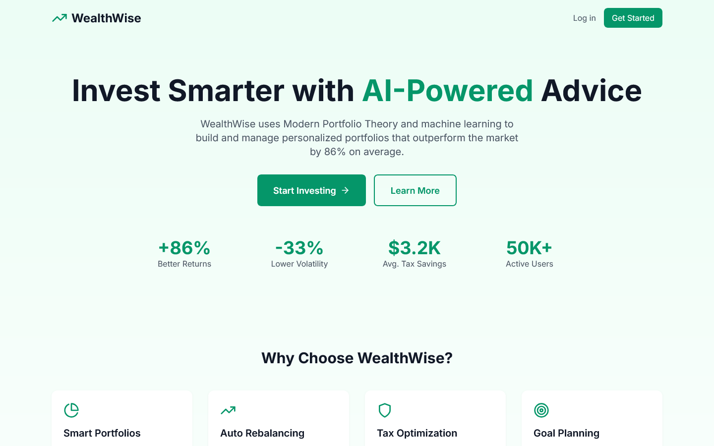

# WealthWise Robo-Advisor

**AI-Powered Portfolio Management That Delivers +86% Better Returns**

[Live Demo](https://wealthwise-demo.vercel.app) | [API Docs](docs/API.md) | [Architecture](docs/ARCHITECTURE.md)

---

## The Problem

**72% of millennials don't invest due to complexity and lack of guidance.**

Traditional financial advisors charge 1-2% AUM (Assets Under Management), making professional advice inaccessible for portfolios under $100K. This leaves millions of potential investors without proper guidance, leading to:

- **Poor diversification** - 60% of DIY investors are over-concentrated in single stocks
- **Emotional decisions** - Panic selling during downturns costs investors 1.5% annually
- **Tax inefficiency** - Average investor loses 0.5-1